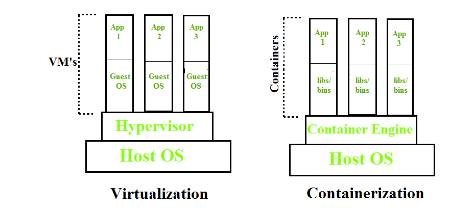

Containerization is OS-based virtualization that creates multiple virtual units in the userspace, known as Containers. Containers share the same host kernel but are isolated from each other through private namespaces and resource control mechanisms at the OS level. Container-based Virtualization provides a different level of abstraction in terms of virtualization and isolation when compared with hypervisors. Hypervisors use a lot of hardware which results in overhead in terms of virtualizing hardware and virtual device drivers. A full operating system (e.g -Linux, Windows) runs on top of this virtualized hardware in each virtual machine instance.

But in contrast, containers implement isolation of processes at the operating system level, thus avoiding such overhead. These containers run on top of the same shared operating system kernel of the underlying host machine and one or more processes can be run within each container. In containers you don’t have to pre-allocate any RAM, it is allocated dynamically during the creation of containers while in VMs you need to first pre-allocate the memory and then create the virtual machine. Containerization has better resource utilization compared to VMs and a short boot-up process. It is the next evolution in virtualization.

The nature of Pods is ephemeral this means that in any case if a pod fails then Kubernetes can and will automatically create a new replica/ duplicate of the said pod and continue the operation